<div align="center">


### 👋 Welcome to my GitHub Profile!

[](https://instagram.com/antuah_d)
[](mailto:jantoniodiazcontact@gmail.com)
[](https://antuah.github.io/CVAntonio/)


</div>

---

## 👨‍💻 About Me

🎓 Software Development Engineering student at **UTEZ México**, passionate about creating innovative solutions through code. Currently focused on full-stack development with a special interest in mobile applications and cloud technologies. 

```javascript
const antonio = {
  location: "📍 Morelos, México",
  currentWork: "🔭 Building Python Web Projects",
  learning: "🌱 Laravel, Vue.js & Inertia.js",
  expertise: "💡 React Native Development",
  interests: "☁️ Cloud Computing & Mobile Apps",
  philosophy: "💻 Code with passion, deploy with confidence"
};
```

<div align="center">
  
</div>

## 🛠️ Technical Skills

### **Frontend Development**
<p>
  
  
  
  
  
  
  
  
</p>

### **Backend Development**
<p>
  
  
  
  
  
  
</p>

### **Mobile & Desktop**
<p>
  
  
  
</p>

### **Database & Cloud**
<p>
  
  
  
  
  
</p>

### **Tools & DevOps**
<p>
  
  
  
  
  
  
</p>

### **Testing**
<p>
  
  
</p>

---

## 📊 GitHub Analytics

<div align="center">
  
</div>

<div align="center">
  
</div>

---

## 🎯 Current Focus

```mermaid
graph LR
    A[🎯 Learning] --> B[Vue.js & Inertia.js]
    A --> C[Laravel Advanced]
    A --> D[Cloud Architecture]
    E[💼 Building] --> F[Python Web Projects]
    E --> G[Mobile Applications]
    E --> H[Portfolio Projects]
```

<div align="center">



</div>

---

## 🤝 Contributions & Activity

<div align="center">
  
</div>

---

## 📬 Get In Touch

<div align="center">

### 💬 Let's Connect!

I'm always open to discussing new projects, creative ideas, or opportunities to be part of your vision. 

<table>
  <tr>
    <td align="center" width="50%">
      <br/>
      <b>Email</b><br/>
      <a href="mailto:jantoniodiazcontact@gmail.com">jantoniodiazcontact@gmail.com</a>
    </td>
    <td align="center" width="50%">
      <br/>
      <b>Portfolio</b><br/>
      <a href="https://antuah.github.io/CVAntonio/">View Online CV</a>
    </td>
  </tr>
</table>

**🤝 Open to:**
- 💼 Job Opportunities
- 🚀 Collaborative Projects
- 💡 Tech Discussions
- 🎓 Mentorship

</div>

---

<div align="center">

### ✨ Thank you for visiting! ✨


**⭐ If you find my work interesting, feel free to star my repositories!**


</div>
